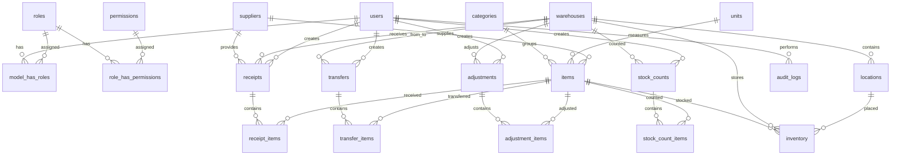

# Inventory API Database Schema / ERD

Core tables:

- `users`: application users for Passport login and Spatie role assignment.
- `roles`, `permissions`, `model_has_roles`, `model_has_permissions`, `role_has_permissions`: Spatie authorization tables.
- `categories`, `units`, `suppliers`, `warehouses`, `locations`: master data.
- `items`: SKU-managed product/item catalog with optional uploaded image.
- `inventory`: current stock per item, warehouse, and optional location.
- `receipts`, `receipt_items`: inbound stock documents.
- `transfers`, `transfer_items`: stock movement between warehouses/locations.
- `adjustments`, `adjustment_items`: manual stock corrections.
- `stock_counts`, `stock_count_items`: physical count sessions and variances.
- `audit_logs`: request/action trail.
